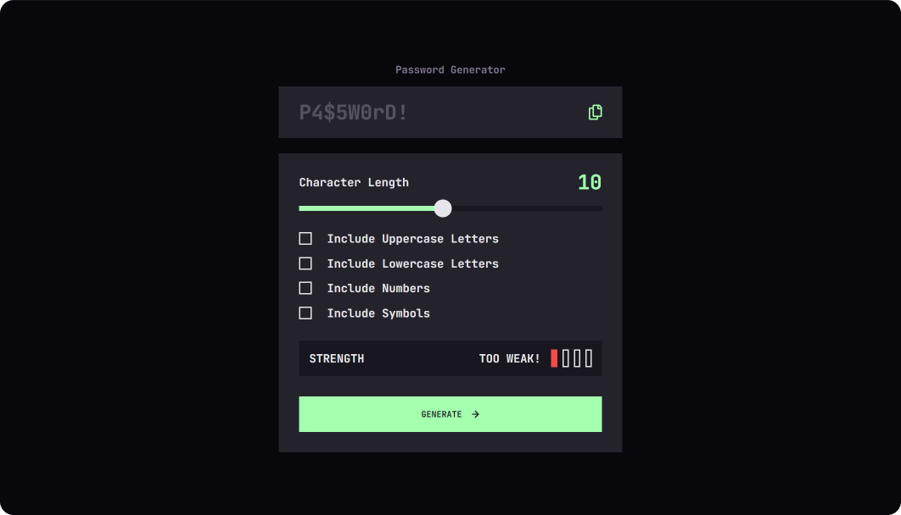

# Frontend Mentor - Password generator app solution

This is a solution to the [Password generator app challenge on Frontend Mentor](https://www.frontendmentor.io/challenges/password-generator-app-Mr8CLycqjh). Frontend Mentor challenges help you improve your coding skills by building realistic projects. 

## Table of contents

- [Overview](#overview)
  - [The challenge](#the-challenge)
  - [Screenshot](#screenshot)
  - [Links](#links)
- [My process](#my-process)
  - [Built with](#built-with)
  - [What I learned](#what-i-learned)
  - [Continued development](#continued-development)
- [Author](#author)

## Overview

### The challenge

Users should be able to:

- Generate a password based on the selected inclusion options
- Copy the generated password to the computer's clipboard
- See a strength rating for their generated password
- View the optimal layout for the interface depending on their device's screen size
- See hover and focus states for all interactive elements on the page

### Screenshot

### Links

- Solution URL: [GitHub Repo](https://github.com/ryanbradley-webdev/password-generator)
- Live Site URL: [Hosted on Netlify](https://password-generator-rbwd.netlify.app/)

## My process

### Built with

- [React](https://reactjs.org/) - JS library

### What I learned

Generating a unique password with varying characters was initally confusing to me, but I found an implementation that I feel works pretty well.

I store the selected options in state, and then created arrays to store the characters according to their corresponding option. When the password is generated, a new array is created as a combination of the selected arrays, and then the cumulative array length is used with Math.random() to pull a random character from that array.

### Continued development

Styling inputs continues to be a challenge, especially when browsers don't allow custom styling directly. I hope to improve my methods of input styling while maintaining browser compatability and accessibility.

## Author

- Portfolio - [ryanbradleyportfolio.com](https://ryanbradleyportfolio.com)
- Frontend Mentor - [@ryanbradley-webdev](https://www.frontendmentor.io/profile/ryanbradley-webdev)
- Instagram - [@ryanbradley_web_dev](https://www.instagram.com/ryanbradley_web_dev/)